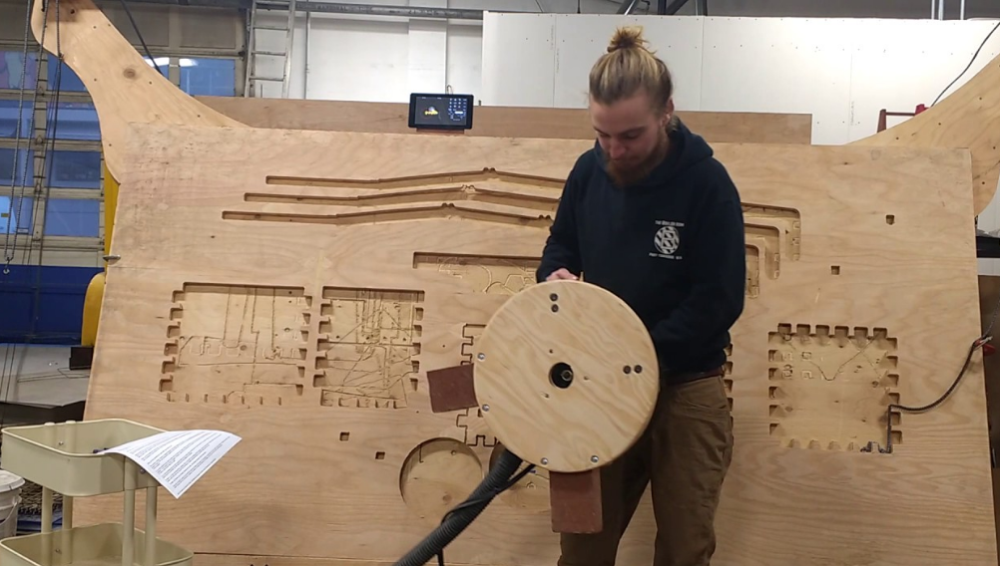

<!-- $theme: gaia -->

# Fox.Build

---

# What's a Makerspace

 * Offline social network for Engineers, Artists, Entrepreneurs

---

# What's a Makerspace

 * Place for learning, similar to a library

---

---

# Makerspaces in Chicagoland

 * Community vs. Service vs. Coworking-only

---

# Makerspaces in Chicagoland

 * Youth focused vs. Adult focused

---

# Fox.Build History

 * Started February in 2016 after one week of planning
 * 100% of funding from memberships
 * ~45 members
 * Numerous monthly and weekly social gatherings

---

---

# What We Offer

X-Carve

---

# What We Offer

Prusa

---

# What We Offer

Meetups / Classes

---

# What We Offer

Prusa

---

# Where?

15 S. 2nd St. in  St. Charles.

---

# Our Members

  * Software Engineers
  * Electrical Engineer
  * Mechanical Engineers
  * Biologists and "Bio Hackers"
  * Architects
  * Welders, Wood Workers and Craftsmen
  * FAA Licensed Drone Pilots
  * Geologists
  * People having fun creating new things

---

# Past Projects
 * Maslow CNC
 * Milk Dispenser
 * MQTT Class
 * Drafting Class

---

# How We Help Entrepreneurs

---

# How We Help Engineers

---

# How We Help Established Businesses

---

# How We Help the Fox Valley

---

# Future Plans

 * New building
 * Tech Hub
 * More equipment
 * More classes

---

# Visit Fox.Build!

 * Email: info@fox.build
 * Website: www.fox.build
 * Phone: 623-414-8346
 * Hours of operation: Call ahead
