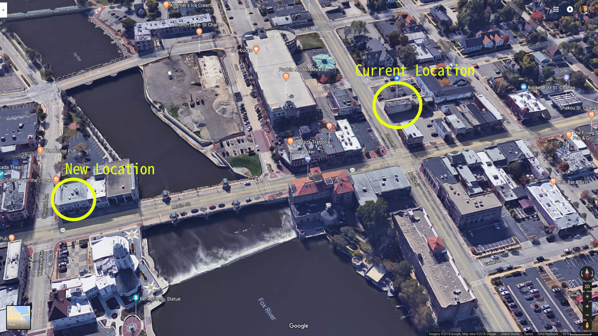
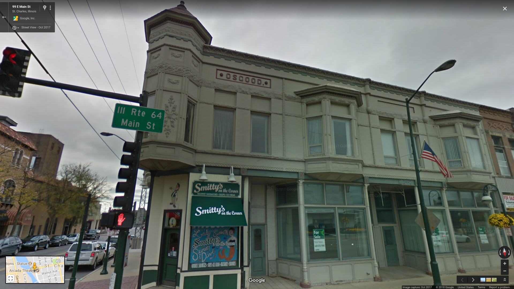
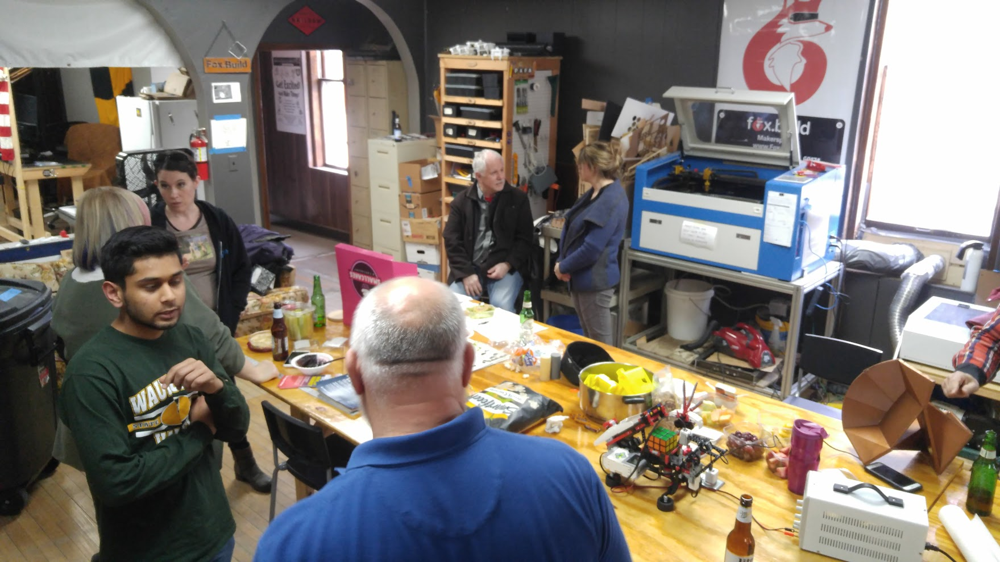
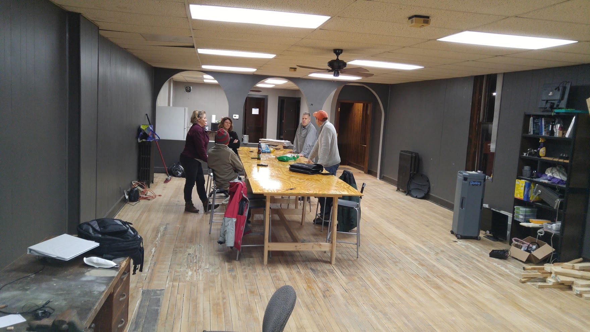
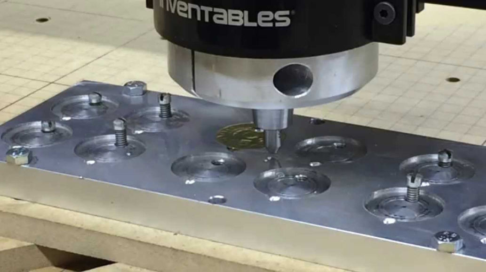
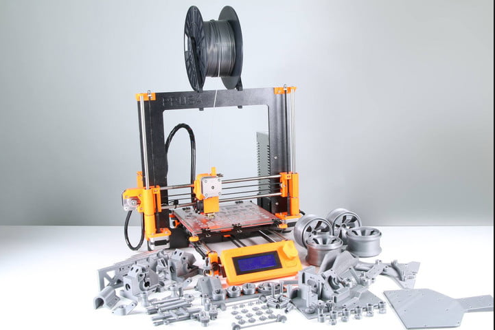
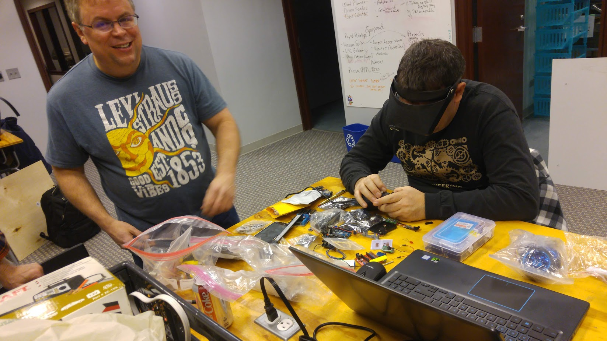

<!-- $theme: gaia -->
## Fox.Build

---

# Hello!

**Rick Carlino**

Software developer and technologist.

Attended ASU, grew up in the NW burbs.

Helping build a tech startup from 9 to 5.

---

# A Makerspace?

 * An offline social network for Engineers, Artists, Entrepreneurs
 * A Library of tools and manufacturing equipment
 * **A community**

---

# Where?

...

---

15 S. 2nd St. in  St. Charles.

---

---
# Daily Activity

 * Learning and making, similar to a library.
 * Co-working.
 * Socializing.

...

---

---

# Makerspaces Varieties

 * Community (Non-Profit)
 * Service (For-Profit)
 * Coworking-only

---

# Makerspaces Varieties

 * Youth focused
 * Adult focused

---

# Fox.Build History

 * Started February in 2016 after one week of planning
 * 100% of funding from memberships
 * ~45 members
 * Numerous monthly and weekly social gatherings

---

Early Fox.Build, circa February 2016

...

---

---

# Equipment We Offer

...

---

X-Carve

---

Prusa

---

# Events

Meetups / Classes / Networking

---

---

# Members (I)

  * Software Engineers
  * Electrical Engineer
  * Mechanical Engineers
  * Biologists and "Bio Hackers"
  * Architects

---

# Members (II)

  * Welders, Wood Workers and Craftsmen
  * FAA Licensed Drone Pilots
  * Geologists
  * People having fun creating new things

---

# Projects (I)

 * Maslow CNC
 * Milk Dispenser
 * MQTT Class
 * Drafting Class

---

# Projects (II)

 * Metal Milling Class
 * Wire Bender
 * Meat Smoker
 * Column Chromatography

---

# How We Help Entrepreneurs

---

# How We Help Engineers

---

# How We Help Established Businesses

---

# How We Help the Fox Valley

---

# Future Plans

 * New building
 * Tech Hub
 * More equipment
 * More classes
 * More Entrepreneurship Support

---

# Help!

 * Become a member
 * Teach a class
 * Donate equipment

---

# Visit Fox.Build!

 * Email: info@fox.build
 * Website: www.fox.build
 * Phone: 623-414-8346
 * Hours of operation: Please call ahead
